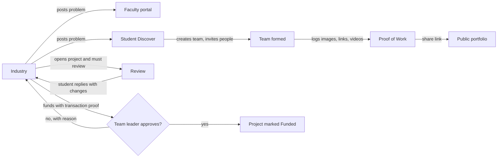
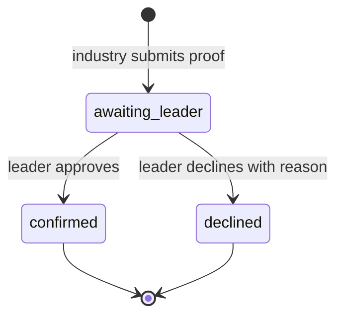
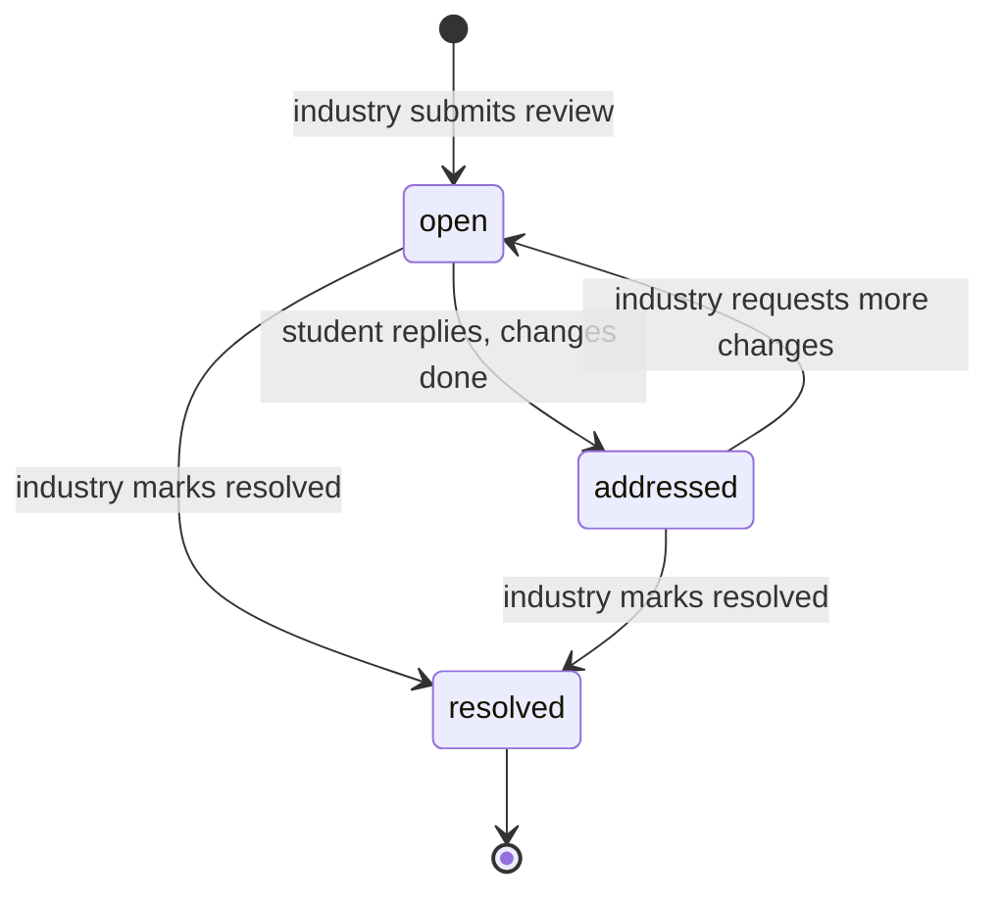
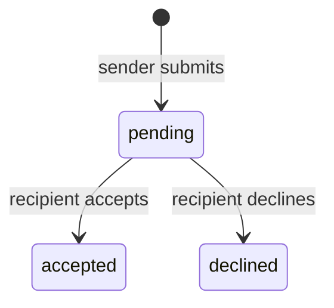

# InnovateX

**A campus innovation platform where industry posts real problems, students form cross-institution teams to solve them, faculty guide the work, and industry reviews, mentors and funds the best projects.**


<!-- Screenshot: docs/screenshot.png -->

---

## Contents

1. [The problem it solves](#1-the-problem-it-solves)
2. [Who uses it and what they can do](#2-who-uses-it-and-what-they-can-do)
3. [End-to-end journey](#3-end-to-end-journey)
4. [Business rules](#4-business-rules)
5. [Permissions matrix](#5-permissions-matrix)
6. [State machines](#6-state-machines)
7. [Data model](#7-data-model)
8. [Validation rules](#8-validation-rules)
9. [Architecture](#9-architecture)
10. [Store API reference](#10-store-api-reference)
11. [Component reference](#11-component-reference)
12. [Getting started](#12-getting-started)
13. [Routes](#13-routes)
14. [Project structure](#14-project-structure)
15. [Demo walkthrough](#15-demo-walkthrough)
16. [Troubleshooting and FAQ](#16-troubleshooting-and-faq)
17. [Known limitations](#17-known-limitations)
18. [Roadmap](#18-roadmap)
19. [Contributing and license](#19-contributing-and-license)

---

## 1. The problem it solves

Colleges and schools have talented students, companies have real problems, and the two rarely meet in a structured way. InnovateX gives every side one place to work:

| Pain point | How InnovateX handles it |
|---|---|
| Students can't find real problems to solve | Industry and community problem statements in **Discover**, filterable by domain |
| Cross-institution teams are hard to form | **New Project** wizard with a searchable contact list, "reason to join" pitch and collaboration requests |
| Funding disputes ("did the team actually receive it?") | Funding is only marked **Funded** after the **team leader** confirms receipt |
| Feedback from industry is vague or lost | Every project view requires a **structured review**; students reply with the changes they made |
| Students can't prove what they built | **Proof of Work** with images, links and videos, shown in a **shareable public portfolio** |
| Faculty don't see what industry is asking for | A **problem-statement portal** listing every posted problem, with New / Shortlisted / CSR views |
| Identity confusion across roles | **Role-based Virtual IDs** (`STU-`, `FAC-`, `IND-`, `MEN-`, `ADM-`) |

---

## 2. Who uses it and what they can do

### Student (`STU-YYYY-NNNN`)

| Page | What it does |
|---|---|
| **Dashboard** | Stats (active projects, teams joined, proof of work, portfolio views), active projects with latest activity, Virtual ID card, suggested problems |
| **Discover** | Industry and Community tabs, search, domain filters, problem detail modal, "start working" action. Also lists problems posted by industry in real time |
| **My Projects** | Project list, workspace and team tabs, mentor request modal, **Proof of Work tab**, **+ New Project** |
| **New Project** | 4-step wizard: project details, team (contact list + reason to join), mentor, send requests |
| **Reviews** | Industry reviews on your teams' projects, tabbed by *Needs your reply / Waiting on reviewer / Resolved*, reply with changes made |
| **Action Center** | One inbox: funding awaiting your approval (as leader), reviews to answer, team and mentor invites, requests you sent |
| **Funding** | External opportunities (grants, fellowships, workshops) with apply flow, plus **funding sent by industry to your teams** with approve / decline |
| **Portfolio** | Stage-filtered project showcase, detail view with proof of work, **Share Public Profile** link management |
| **Settings** | LinkedIn profile, institution-change request to a faculty member, password reset, account deletion request |
| **Leaderboard** | Existing page in your app (not modified) |

### Industry (`IND-YYYY-NNNN`)

| Page | What it does |
|---|---|
| **Dashboard** | Stats (problems posted, teams working, projects funded with confirmed vs awaiting amounts), project table with funding badge, review badge and progress, actions: Mentor, Workshop, Fund, **View & review** |
| **Post Problem** | Title, description, domain (Technology, Healthcare, Education, Environment, Finance, Agriculture, Logistics), tags, CSR flag. **Publish now saves** and the problem shows up for faculty and students |
| **Discover Projects** | Browse all student projects, filter by stage (All / Ideation / Building / Prototype / Funded), same fund and review flow |
| **CSR Impact** | Impact summary: projects funded, students reached, patents incubated, startups spun off |

### Faculty (`FAC-YYYY-NNNN`)

| Page | What it does |
|---|---|
| **Dashboard** | Stats (projects mentored, active, completed, students guided), charts, **My Teams** table, **+ Form Team**, banner for new problem statements, Virtual ID card |
| **Problem Statements** | Portal for every incoming problem. Search, domain filter, tabs *All / New / Shortlisted / CSR*, read the full brief, shortlist for your students |
| **Students** | Register students with an auto-generated **role-based Virtual ID**; table of Virtual ID, LinkedIn, status, projects, join date |
| **Change Requests** | Approve or decline students' institution-change requests |
| **Review Panel** | Pick a team, approve milestones, give feedback |

### Admin (`ADM-YYYY-NNNN`) and Mentor (`MEN-YYYY-NNNN`)

Admin has Analytics and Funding Verification pages in your app (unchanged). Mentors are the target of mentor requests from students and industry; their Virtual ID format is supported by the generator.

---

## 3. End-to-end journey



A typical cycle: an industry partner posts a problem, faculty shortlist it for their students, a student creates a team from the contact list, the team builds and logs proof of work, industry reviews the project and the team responds, industry funds it, and the team leader confirms the money arrived.

---

## 4. Business rules

| Rule | Detail |
|---|---|
| **Funding needs the team leader** | Funding is created as `awaiting_leader`. The project stage becomes *Funded* only when the leader confirms. Other members can see it but cannot approve. Declines require a reason shown to the funder. |
| **Reviews are mandatory** | Industry cannot close a project view until a review is submitted (or a follow-up is posted in an existing review thread). |
| **Who forms a team** | Same-school members: that school's **faculty**. Any college or university member, or members from different institutions: **students** (faculty are not involved). |
| **Faculty at colleges / universities** | Do not form teams. The Form Team button explains the rule. |
| **Mentor required** | If every member of the team is a school student, a mentor must be selected. |
| **Team leader** | The student who creates a team is its leader. Faculty choose the leader when forming a school team. |
| **Portfolio sharing** | Opt-in. Link can be switched private (kept) or regenerated (old link dies). |
| **Virtual IDs** | One prefix per role, sequence is always `max(existing for that role) + 1`. |

---

## 5. Permissions matrix

| Action | Student | Student leader | Industry | Faculty (school) | Faculty (college / univ.) |
|---|:-:|:-:|:-:|:-:|:-:|
| Post a problem statement | | | ✔ | | |
| View problem statements | ✔ | ✔ | ✔ | ✔ | ✔ |
| Shortlist problems | | | | ✔ | ✔ |
| Create a team (cross-institution / college) | ✔ | ✔ | | | |
| Form a same-school team | | | | ✔ | |
| Send funding | | | ✔ | | |
| **Approve / decline funding** | | **✔** | | | |
| Write a review | | | ✔ | | |
| Reply to a review | ✔ | ✔ | | | |
| Follow up / resolve a review | | | ✔ | | |
| Add proof of work | ✔ | ✔ | | | |
| Share public portfolio | ✔ | ✔ | | | |
| Register students | | | | ✔ | ✔ |

> These are enforced in the UI today. When you add a backend, enforce them on the server as well.

---

## 6. State machines

**Funding record**



A declined record lets the funder click **Fund again**, which creates a new record. The project shows *Funded* only while the latest record is `confirmed`.

**Review**



**Collaboration request** (team invite or mentor request)



On accept, a member invite flips the teammate from `Invited` to `Member`; a mentor request sets the project's mentor. On decline, the member is removed from the team.

---

## 7. Data model

Defined in [`src/store/workflow.ts`](src/store/workflow.ts). Key types (trimmed):

```ts
type InstitutionType = 'School' | 'College';        // "College" also covers universities

interface FundingRecord {
  id: string; projectId: string; projectTitle: string; teamName: string;
  leaderId: string; leaderName: string;             // who must approve
  amountLakh: number; txnRef: string; proofFile: string;
  funder: string; funderOrg: string;
  status: 'awaiting_leader' | 'confirmed' | 'declined';
  declineNote?: string; createdAt: number; respondedAt?: number;
}

interface ProjectReview {
  id: string; projectId: string; projectTitle: string; teamName: string;
  reviewerId: string; reviewerName: string; reviewerOrg: string;
  summary: string; strengths: string; flaws: string; improvements: string;
  status: 'open' | 'addressed' | 'resolved';
  replies: { id: string; authorRole: 'student' | 'industry'; authorName: string; text: string; createdAt: number }[];
  createdAt: number;
}

interface ProofEntry {
  id: string; projectId: string; title: string; description: string;
  attachments: { id: string; kind: 'image' | 'link' | 'video'; url: string; name?: string }[];
  authorName: string; createdAt: number;
}

interface CollabRequest {
  id: string; kind: 'member' | 'mentor'; direction: 'incoming' | 'outgoing';
  projectId: string; projectTitle: string; from: Person; to: Party;
  reason: string; status: 'pending' | 'accepted' | 'declined'; createdAt: number;
}

interface StudentProject {                          // same shape as MOCK_PROJECTS, plus:
  teamName?: string; leaderId: string; formedBy: 'student' | 'faculty';
  /* id, title, stage, description, category, institution, team[], activityLog[], ... */
}

interface ShareProfile { ownerId: string; slug: string; enabled: boolean; name: string; institution: string }
```

---

## 8. Validation rules

| Field | Rule |
|---|---|
| Funding amount | Number greater than 0 (₹ lakhs) |
| Funding proof | Transaction reference required, plus a confirmation checkbox |
| Funding approval | Leader must tick the receipt confirmation |
| Funding decline | Reason of at least 5 characters |
| Review: assessment, flaws, improvements | At least 10 characters each; "what works" optional |
| New project | Title at least 3 characters, description at least 10 |
| Team invite | At least 1 invitee and a **reason to join** of at least 10 characters |
| Mentor | Required if the team is school-only |
| Faculty Form Team | Team name, project title, at least 2 students, one chosen leader |
| Proof of work | Title at least 3 characters and at least 1 attachment |
| Image upload | `image/*` only, max **2 MB** each (stored as data URL) |
| Video upload | `video/*` only, max **100 MB**, session-only |
| Links | Must be a valid URL; `https://` is added if missing |
| Video links | YouTube, Vimeo, Google Drive play inline; `.mp4 / .webm / .ogg / .mov` use a player; anything else stays a link |

---

## 9. Architecture

```
┌────────────┐   ┌────────────┐   ┌────────────┐
│  Student   │   │  Industry  │   │  Faculty   │   role-based shells + pages
└─────┬──────┘   └─────┬──────┘   └─────┬──────┘
      │  useWorkflow() / action functions │
      └───────────────┬───────────────────┘
               ┌──────▼───────┐
               │ store/       │  useSyncExternalStore
               │ workflow.ts  │  + localStorage (innovatex.workflow.v1)
               └──────┬───────┘  + `storage` event for cross-tab sync
                      │ (replace with API calls later)
               ┌──────▼───────┐
               │   Backend    │  not built yet
               └──────────────┘
```

- **No provider needed.** The store is a module-level singleton read through `useSyncExternalStore`, so nothing changes in `App.tsx`.
- **Cross-tab sync.** A `storage` listener reloads state, so two roles can be demoed in two tabs.
- **Stable snapshots.** `useWorkflow()` returns the whole state object, which only changes when data changes. Filter and map inside components with `useMemo`.
- **Swap-ready.** Components only call exported functions such as `submitFunding` and `addReview`. Replace their bodies with API calls to go live.
- **Demo identities.** `CURRENT_STUDENT`, `CURRENT_FACULTY`, `CURRENT_INDUSTRY`, `CONTACTS` and `TEAM_DIRECTORY` stand in for authentication.

| Demo identity | Value |
|---|---|
| Student | Arjun Mehta, `STU-2024-0042`, IIT Bombay (College) |
| Faculty | Dr. Priya Sharma, `FAC-2024-0007`, Delhi Technological University (College) |
| Industry | Rohan Kapoor, `IND-2024-0003`, Infosys |
| Team Nova | Leader: Arjun (can approve funding) |
| Team Echo | Leader: Karan Malhotra (Arjun is a member and cannot approve) |

---

## 10. Store API reference

| Function | Purpose |
|---|---|
| `useWorkflow()` | Hook: whole shared state |
| `useAllProblems()` | Hook: industry-posted problems + existing `MOCK_PROBLEMS` |
| `submitFunding({ project, amountLakh, txnRef, proofFile })` | Create a funding record as `awaiting_leader` |
| `respondFunding(id, 'confirmed' \| 'declined', note?)` | Leader decision |
| `latestFunding(fundings, projectId)` | Most recent record for a project |
| `getTeamLeader(teamName)`, `isMemberOf(teamName, studentId)` | Team lookups |
| `addReview({ projectId, projectTitle, teamName, summary, strengths, flaws, improvements })` | Industry review |
| `addReply(reviewId, { authorRole, authorName, text }, nextStatus?)` | Reply and optionally change status |
| `addProof(entry)`, `removeProof(id)` | Proof of work |
| `publishProblem({ title, description, domain, tags, csr })` | Industry posts a problem |
| `markProblemSeen(id)`, `toggleShortlist(id)` | Faculty portal actions |
| `createProject(project)` | Create a team project, returns its id |
| `addRequests(requests)`, `respondCollab(id, 'accepted' \| 'declined')` | Collaboration requests |
| `teamFormationRule(members)` | Returns `{ formedBy: 'faculty' \| 'student', note }` |
| `ensureProfile(person)`, `setProfileEnabled(id, bool)`, `regenerateSlug(person)`, `publicProfileUrl(slug)` | Portfolio sharing |
| `registerStudent(student)` | Faculty registers a student |
| `generateVirtualId(role, existingIds, year?)` | In `utils/virtualId.ts` |
| `parseVirtualId(id)` | Returns `{ role, year, seq }` or `null` |

Virtual ID examples: `STU-2026-0090`, `FAC-2026-0008`, `IND-2026-0004`, `MEN-2026-0002`, `ADM-2026-0001`.

---

## 11. Component reference

| Component | Props | Used by |
|---|---|---|
| `FundModal` | `project: { id, title, team, institution, stage }`, `onClose` | IndustryDashboard, DiscoverProjects |
| `FundingApprovalCard` | `record: FundingRecord` | Funding, StudentActions |
| `ProjectReviewModal` | `project: { id, title, team, institution, stage, progress, members }`, `onClose` | IndustryDashboard, DiscoverProjects |
| `ReviewThread` | `review`, `viewer: 'student' \| 'industry'`, `onEngaged?` | Review page, ProjectReviewModal |
| `ProofOfWork` | `projectId`, `editable?` (default `true`) | MyProjects, portfolio detail (read-only) |
| `FormTeamModal` | `onClose` | FacultyDashboard |
| `PortfolioGrid` | `projects: PortfolioProject[]` | Portfolio, PublicPortfolio |

---

## 12. Getting started

**Prerequisites:** Node.js 18+ and npm (or yarn / pnpm).

```bash
git clone https://github.com/<your-username>/innovatex.git
cd innovatex
npm install
npm run dev        # check package.json for your exact dev script
```

Type check: `npx tsc --noEmit`

No new dependencies are required by the workflow features.

---

## 13. Routes

Wrap each page in the shell your app already uses for that role.

```tsx
{/* Student */}
<Route path="/student/new-project" element={<StudentShell><NewProject /></StudentShell>} />
<Route path="/student/reviews"     element={<StudentShell><Review /></StudentShell>} />
<Route path="/student/actions"     element={<StudentShell><StudentActions /></StudentShell>} />

{/* Faculty */}
<Route path="/faculty/problems"    element={<FacultyShell><ProblemStatements /></FacultyShell>} />

{/* Public: no shell, no login guard, so shared links open for anyone */}
<Route path="/u/:slug"             element={<PublicPortfolio />} />
```

Inside `<Routes>`, use `{/* comments */}`; a plain `//` is a syntax error. Also add sidebar links for **Reviews**, **Actions** and **Problem Statements**.

Internal navigation: `MyProjects` goes to `/student/new-project`, `NewProject` to `/student/actions`, `StudentActions` to `/student/reviews`, `FacultyDashboard` to `/faculty/problems`. Change those four calls if your paths differ.

With `BrowserRouter`, your host must serve `index.html` for unknown paths or shared `/u/:slug` links will 404 on direct open. With `HashRouter` the link becomes `/#/u/:slug` automatically.

---

## 14. Project structure

```
src/
├── store/
│   └── workflow.ts               shared store, demo identities, all actions
├── utils/
│   └── virtualId.ts              role-based Virtual ID generator
├── components/
│   ├── FundModal.tsx             industry funding flow (amount, then proof)
│   ├── FundingApprovalCard.tsx   team-leader approve / decline
│   ├── ProjectReviewModal.tsx    mandatory review + reusable ReviewThread
│   ├── ProofOfWork.tsx           images, links, videos
│   ├── FormTeamModal.tsx         faculty team formation (school only)
│   └── PortfolioGrid.tsx         portfolio cards, stage filter, detail view
└── pages/
    ├── student/    NewProject · Review · StudentActions · Portfolio · Funding
    │               MyProjects · Discover · StudentDashboard · StudentSettings
    ├── industry/   IndustryDashboard · DiscoverProjects · PostProblem · CSRImpact
    ├── faculty/    FacultyDashboard · Students · ProblemStatements
    │               ChangeRequests · ReviewPanel
    └── public/     PublicPortfolio
docs/
└── WORKFLOWS.md    step-by-step flows and integration notes
```

`components/ui`, `components/Toast` and `data/mock` are your existing shared files and are imported by the pages exactly as before.

---

## 15. Demo walkthrough

Open two browser tabs; they stay in sync.

1. **Fund a team.** Industry tab: Dashboard, **Fund** on Team Nova, complete amount and proof. It shows *awaiting Arjun*. Student tab: **Actions**, tick the confirmation, **Approve funding**. Industry tab now shows **Funded**.
2. **See the leader rule.** Fund Team Echo, then open **Funding** in the student tab. Arjun sees "Only the team leader, Karan Malhotra, can approve".
3. **Review loop.** Industry: **View & review**, try closing (blocked), submit. Student: **Reviews**, reply with **Reply · changes done**. Industry: reopen, **Mark resolved**.
4. **Problem statements.** Industry: **Post Problem**, publish. Faculty: **Problem Statements** shows it as *New*. Student: **Discover** lists it.
5. **Team and requests.** Student: **My Projects > + New Project**, pick contacts, write the reason to join, pick a mentor, send. Open **Actions**; use *Demo: mark accepted* to simulate a reply.
6. **Proof of work and portfolio.** Student: **My Projects > Proof of Work**, add an image, a GitHub link and a YouTube link. Then **Portfolio > Share Public Profile**, copy and open the link.
7. **Faculty team formation.** In `workflow.ts` set `CURRENT_FACULTY.institution = 'Delhi Public School, R.K. Puram'` and `institutionType = 'School'`, then Faculty Dashboard, **+ Form Team**.

More detail: [docs/WORKFLOWS.md](docs/WORKFLOWS.md).

---

## 16. Troubleshooting and FAQ

| Question | Answer |
|---|---|
| The shared portfolio link says "isn't available" | The link only works in the browser that created it (no backend yet), the profile may be switched private, or the link was regenerated |
| Form Team only shows an explanation | The demo faculty is at a college. Change `CURRENT_FACULTY` to a school, see the demo walkthrough |
| A video vanished after reload | Uploaded video *files* are session-only. Use a YouTube, Vimeo or Drive link |
| An image upload is rejected | Images must be `image/*` and 2 MB or smaller |
| How do I reset demo data? | Run `localStorage.removeItem('innovatex.workflow.v1')` in the browser console and reload |
| Storage quota errors | Data URLs for images fill localStorage (about 5 MB total). Move files to a backend store |
| Shared link gives 404 on refresh | Configure your host to serve `index.html` for unknown paths (BrowserRouter) |
| A route in my app is different | Update the four `navigate(...)` calls listed under [Routes](#13-routes) |

---

## 17. Known limitations

- No authentication or server: leader-only funding and industry-only reviews are enforced in the UI only.
- Other users cannot answer invites until real accounts exist. Action Center has a labelled **Demo: mark accepted** button for outgoing requests.
- Reviews and funding are keyed by team name through `TEAM_DIRECTORY`; with a backend, key them by real project and team IDs.
- Images live inside localStorage; videos uploaded from disk are not persisted.

---

## 18. Roadmap

- [ ] Backend API and real authentication (JWT / SSO)
- [ ] Server-side enforcement of every rule in the permissions matrix
- [ ] File storage for images and videos (S3 or similar)
- [ ] Email and push notifications for invites, reviews and funding
- [ ] Server-hosted public portfolios that open across browsers
- [ ] Admin verification of funding records against bank data
- [ ] Automated tests in CI

---

## 19. Contributing and license

1. Fork and branch: `git checkout -b feature/your-feature`
2. Run `npx tsc --noEmit` before committing
3. Open a pull request describing what changed and why; open an issue first for larger changes

License: add your license (for example MIT) and a `LICENSE` file in the repo root.
